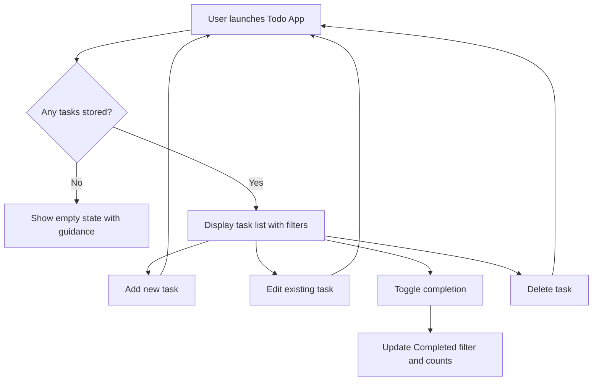

[spec.md](https://github.com/user-attachments/files/22655852/spec.md)
# Feature Specification: Todo App

**Feature Branch**: `001-requirement-create-a`  
**Created**: October 2, 2025  
**Status**: Draft  
**Input**: User description: "Requirement: Create a Todo App. Write a spec.md file for component todo-app following Speckit conventions with Overview (WHAT), Acceptance criteria (detailed features), Illustration section embedding .specify/assets/image.jpg, and a Mermaid diagram for the main workflow."

## Execution Flow (main)
```
1. Parse user description from Input
   → Key concepts: task management, fast updates, completion states, responsive UI
2. Extract actors, actions, data, constraints
   → Actor: individual user managing personal tasks
   → Actions: create, edit, complete, delete, filter todos
   → Data: todo items (title, notes, status, timestamps)
   → Constraints: instant feedback, multi-device support, persistent state (to be clarified)
3. Flag ambiguities for follow-up
   → [NEEDS CLARIFICATION: Authentication or multi-user access required?]
   → [NEEDS CLARIFICATION: Persistence expectations—local storage or server sync?]
4. Produce user scenarios and edge cases grounded in requested behavior
5. Define functional requirements with measurable outcomes
6. Identify key entities and relationships supporting the experience
7. Review completeness; log unresolved questions
8. Return: SPEC READY (pending clarification resolution)
```

---

## ⚡ Quick Guidelines
- ✅ Keep the experience uncluttered so users can recognize next actions quickly
- ✅ Provide immediate visual confirmation for every interaction (create, edit, toggle, delete)
- ✅ Maintain accessibility (contrast, keyboard navigation, ARIA state indicators)
- ❌ Avoid prescribing implementation technologies or component structures
- ❌ Do not assume collaborative features unless explicitly requested

### Section Requirements
- Overview explaining user value and scope (WHAT)
- Acceptance criteria capturing essential behaviors and states
- Illustration section with provided asset and high-level flow
- Requirements and entities documented for planning hand-off

### For AI Generation
- Call out every ambiguity using `[NEEDS CLARIFICATION: …]`
- Use user-focused language (no developer shorthand)
- Ensure each requirement is verifiable through a user interaction or observable outcome
- Consider resilience scenarios (offline, low bandwidth) even if unspecified, marking clarifications when needed

---

## User Scenarios & Testing *(mandatory)*

### Primary User Story
As a busy individual, I want a simple Todo App that lets me capture, review, and complete tasks from any device so that I can stay organized throughout the day.

### Acceptance Scenarios
1. **Given** the user opens the Todo App for the first time, **When** there are no tasks, **Then** the UI displays an empty-state message with instructions to add a task.
2. **Given** the user is viewing their todo list, **When** they add a task with a title and optional notes, **Then** the new task appears instantly at the top of the list in the "Active" state.
3. **Given** a task is visible, **When** the user edits the title or notes, **Then** the updates appear immediately without a full page reload.
4. **Given** a task is visible, **When** the user marks it as completed, **Then** the task visually changes state (e.g., checkmark/strikethrough) and is moved or filtered into the "Completed" view.
5. **Given** multiple tasks exist, **When** the user deletes one, **Then** the task disappears and the UI confirms the deletion (toast or undo option).
6. **Given** tasks exist, **When** the user switches filters (All, Active, Completed), **Then** only matching tasks are displayed and counts update accordingly.
7. **Given** the connection is slow or offline, **When** the user attempts to modify a task, **Then** the UI communicates the sync status or queues the change. [NEEDS CLARIFICATION: offline handling]

### Edge Cases
- Handling duplicate task titles without confusing the user.
- Enforcing maximum length for titles/notes to prevent layout issues. [NEEDS CLARIFICATION]
- How reminders or due dates should behave if introduced. [NEEDS CLARIFICATION]
- User deletes a task while simultaneously editing it.

## Acceptance Criteria
- Users can create, edit, complete, delete, and filter tasks without page reloads.
- Empty states offer clear guidance and call-to-action for first-time users.
- Task states (Active vs Completed) are distinguishable via color, iconography, and accessible text.
- Interface adapts to both desktop (≥1024px) and mobile (≤480px) viewports.
- Core interactions provide perceptible response within 200ms.
- Outstanding decisions (authentication, persistence, offline behavior, input limits) are resolved before implementation starts.

## Illustration




## Requirements *(mandatory)*

### Functional Requirements
- **FR-001**: System MUST allow users to create tasks with a required title and optional notes.
- **FR-002**: System MUST render tasks in a list that updates immediately after any user action.
- **FR-003**: System MUST support inline editing of existing tasks (title and notes).
- **FR-004**: System MUST allow users to toggle task status between Active and Completed with clear visual feedback.
- **FR-005**: System MUST provide filters for All, Active, and Completed tasks with accurate counts.
- **FR-006**: System MUST allow users to delete tasks and display an immediate confirmation or undo affordance.
- **FR-007**: System MUST show an instructive empty state when no tasks meet the current filter.
- **FR-008**: System MUST persist tasks across user sessions. [NEEDS CLARIFICATION: storage mechanism]
- **FR-009**: System MUST adapt layout and controls for both mobile and desktop breakpoints.
- **FR-010**: System SHOULD notify users about sync/offline status when connectivity changes. [NEEDS CLARIFICATION]

### Key Entities *(include if feature involves data)*
- **Todo Item**: Unique ID, title, notes, status (Active/Completed), timestamps (created/updated/completed), optional metadata (priority, due date?).
- **Filter View**: Represents the active filter state (All, Active, Completed) and associated counts.
- **User Context**: Scope for storing tasks and preferences. [NEEDS CLARIFICATION: single-user vs multi-user]

---

## Review & Acceptance Checklist
*GATE: Automated checks run during main() execution*

### Content Quality
- [x] No implementation details (languages, frameworks, APIs)
- [x] Focused on user value and business needs
- [x] Written for non-technical stakeholders
- [x] All mandatory sections completed

### Requirement Completeness
- [ ] No [NEEDS CLARIFICATION] markers remain
- [x] Requirements are testable and unambiguous where specified
- [x] Success criteria are measurable
- [x] Scope is clearly bounded
- [ ] Dependencies and assumptions identified (authentication, persistence, offline behavior outstanding)

---

## Execution Status
*Updated by main() during processing*

- [x] User description parsed
- [x] Key concepts extracted
- [x] Ambiguities marked
- [x] User scenarios defined
- [x] Requirements generated
- [x] Entities identified
- [ ] Review checklist passed (clarifications pending)

---
